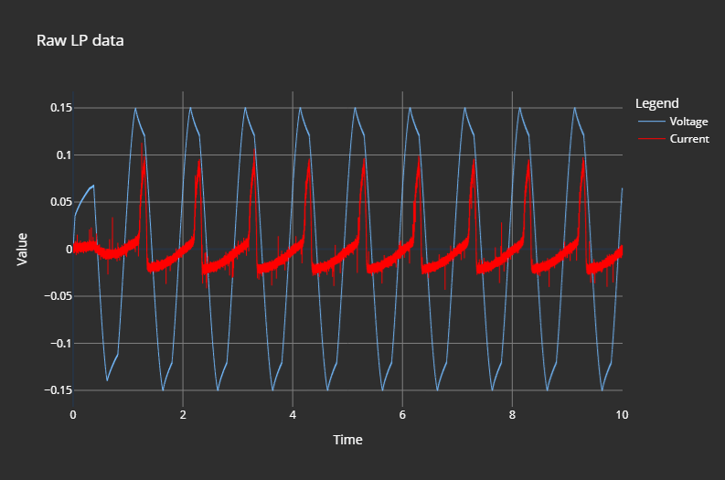

# Langmuir Probe Kit
`lpkit` is a basket of tools to quickly get your plasma temperature and density from a fast sweep of voltage.
## 2025 Yokogawa SL1000
Using a signal generator, connected to an insulated amplifier, we record probe voltage and current. 

## PCB

